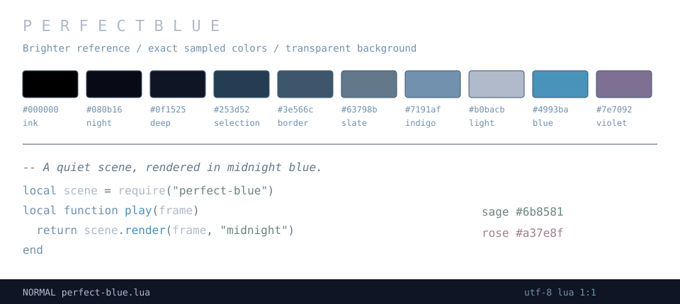

# perfect-blue.nvim

A blue Neovim theme with muted green and red accents built with [Lush](https://github.com/rktjmp/lush.nvim), inspired by the supplied *Perfect Blue* image.



All twelve colors are exact RGB pixels from the brighter 1920 × 1082 reference image. Pale blue-gray text and stronger blue functions provide more separation, with leaf greens for strings and dusty pinks for constants, errors, and deletions. The palette uses no generated colors or HSL conversions. Window separators use Yuki’s neutral `#1a1a1a` instead of a sampled blue to keep sidebar edges unobtrusive.

Diagnostic undercurls, bold errors and warnings, and strikethrough deletions provide additional distinctions. Terminal ANSI red and green use the sampled pink and green.

## Installation

With lazy.nvim:

```lua
{
  "wu-json/perfect-blue.nvim",
  lazy = false,
  priority = 1000,
  config = function()
    vim.opt.termguicolors = true
    vim.cmd.colorscheme("perfect-blue")
  end,
}
```

With LazyVim, install the theme and select it:

```lua
{ "wu-json/perfect-blue.nvim" },
{
  "LazyVim/LazyVim",
  opts = { colorscheme = "perfect-blue" },
}
```

Or add the repo to your Neovim runtime path and run:

```vim
set termguicolors
colorscheme perfect-blue
```

The compiled theme has no plugin dependencies. The editor, sidebars, menus, status line, and floating windows use no background color, preserving your terminal background. It leaves your `background` option unchanged. Selections, search matches, and diffs retain highlight backgrounds.

## Palette

| Color | Hex | Role |
| --- | --- | --- |
| Ink | `#000000` | Cursor/search text and terminal black |
| Night | `#080b16` | Diff backgrounds |
| Deep | `#0f1525` | Diff additions |
| Selection | `#253d52` | Selections and search matches |
| Border | `#3e566c` | Separators and inactive line numbers |
| Slate | `#63798b` | Comments, punctuation, hints |
| Indigo | `#7191af` | Keywords and blue accents |
| Light | `#b0bacb` | Main text |
| Blue | `#4993ba` | Functions, special symbols, terminal blue |
| Violet | `#7e7092` | Terminal magenta |
| Sage | `#6b8581` | Strings, additions, success |
| Rose | `#a37e8f` | Constants, errors, deletions |

[palette.lua](lua/perfect-blue/palette.lua) records the zero-based source pixel coordinates for all twelve colors in `1047483-trailer-gkids-acquires-theatrical-rights-perfect-blue.webp` (1920 × 1082).

## Coverage

Includes editor UI, Vim syntax, Tree-sitter captures, LSP semantic tokens and diagnostics, diffs, and all 16 terminal colors. Also includes highlights for GitSigns, Neo-tree, Telescope, nvim-cmp, blink.cmp, Snacks pickers and dashboard, Lazy, Mason, and Noice. Plugins that define their own unrelated colors may need separate configuration.

## Development

Like [yuki.nvim](https://github.com/wu-json/yuki.nvim) and [chainsaw.nvim](https://github.com/wu-json/chainsaw.nvim), the theme uses a Lush source and a Shipwright-generated colorscheme.

Install `rktjmp/lush.nvim` and `rktjmp/shipwright.nvim` for development. Edit `lua/lush_theme/perfect-blue.lua`, or the exact hex values in `lua/perfect-blue/palette.lua`. Use `:Lushify` on the Lush source for live editing, or load the development variant:

```vim
colorscheme perfect-blue_lush
```

From the repository root, run `:Shipwright` to update `colors/perfect-blue.lua`. Commit the generated file together with the source. Terminal colors live in `lua/perfect-blue/terminal.lua` and are shared by both variants.

The preview above is an SVG illustration of the palette and syntax roles, not an editor screenshot.
