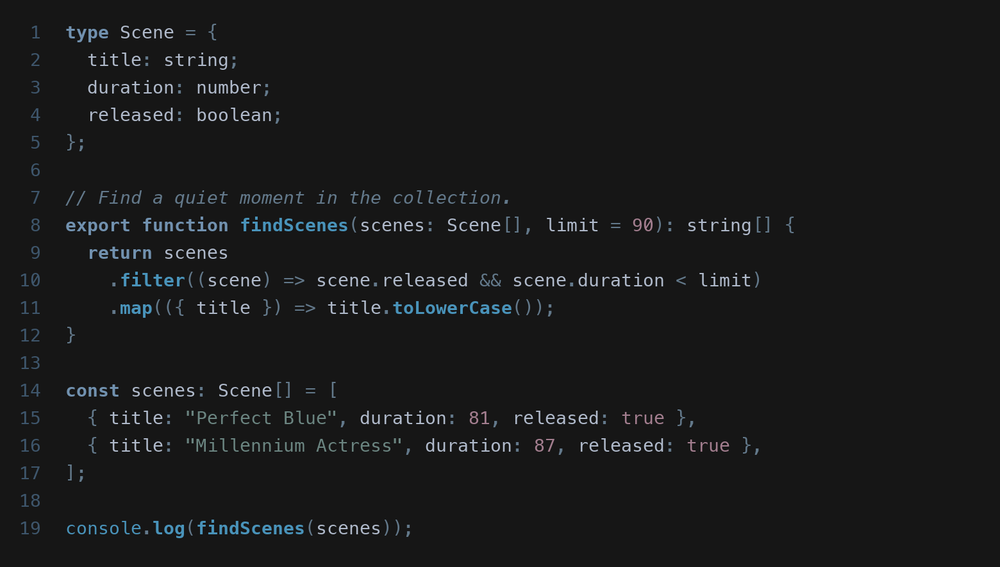
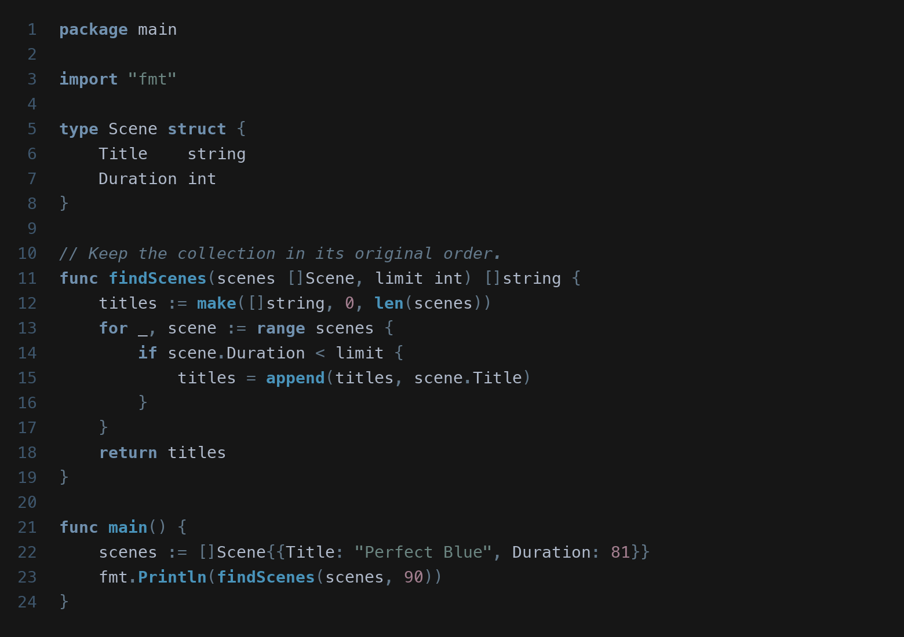
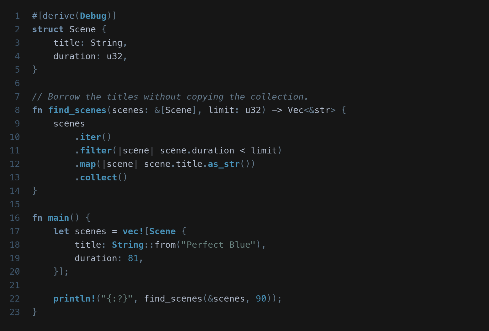
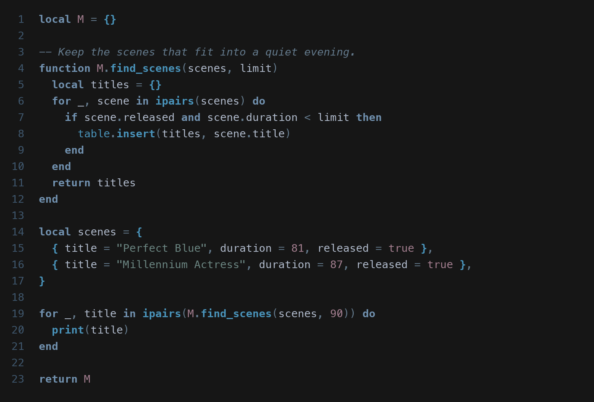

# perfect-blue.nvim

A neovim theme inspired by [Perfect Blue](https://en.wikipedia.org/wiki/Perfect_Blue) by Satoshi Kon.

## Preview

### TypeScript



### Go



### Rust



### Lua



## Installation

### lazy.nvim

```lua
{ "wu-json/perfect-blue.nvim" },
{
  "LazyVim/LazyVim",
  opts = { colorscheme = "perfect-blue" },
}
```

